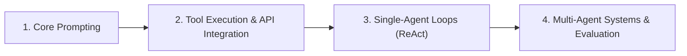

import {
  Card,
  CardHeader,
  CardTitle,
  CardDescription,
  CardContent,
  Badge,
  Accordion,
  AccordionItem,
  AccordionTrigger,
  AccordionContent,
} from '@gv-tech/ui-web';

# AI Recommended Learning List

This is a curated list of resources, courses, and structured guidance to take you from AI novice to building production-ready agentic workflows.

## Recommended Courses & Learning Paths

<div className="grid gap-4 md:grid-cols-2 mt-4 mb-8">
  <Card>
    <CardHeader>
      <CardTitle>ChatGPT Prompt Engineering for Developers</CardTitle>
      <CardDescription><a href="https://www.deeplearning.ai/short-courses/chatgpt-prompt-engineering-for-developers/" target="_blank" rel="noopener noreferrer">DeepLearning.AI & OpenAI</a></CardDescription>
    </CardHeader>
    <CardContent>
      Learn fundamental LLM capabilities, key prompt engineering principles, structured output techniques, and basic API integrations.
      <div className="mt-2 text-xs text-muted-foreground">
        <strong>Who it's for:</strong> Developers & AI beginners.<br/>
        <strong>Why it matters for agents:</strong> Teaches precise instruction formatting and JSON/structured response generation essential for tool calling.
      </div>
      <div className="mt-4 flex gap-2">
        <Badge>Beginner Friendly</Badge> 
        <Badge variant="secondary">Free</Badge>
      </div>
    </CardContent>
  </Card>

  <Card>
    <CardHeader>
      <CardTitle>AI Python for Beginners</CardTitle>
      <CardDescription><a href="https://www.deeplearning.ai/short-courses/ai-python-for-beginners/" target="_blank" rel="noopener noreferrer">DeepLearning.AI (Andrew Ng)</a></CardDescription>
    </CardHeader>
    <CardContent>
      Master Python programming through interactive AI applications, API requests, and data manipulation.
      <div className="mt-2 text-xs text-muted-foreground">
        <strong>Who it's for:</strong> Beginners needing core coding skills for AI.<br/>
        <strong>Why it matters for agents:</strong> Agents run code and make REST/gRPC calls; foundational Python scripting is required to glue agent components together.
      </div>
      <div className="mt-4 flex gap-2">
        <Badge>Python Basics</Badge>
        <Badge variant="secondary">Free</Badge>
      </div>
    </CardContent>
  </Card>

  <Card>
    <CardHeader>
      <CardTitle>Building Systems with the ChatGPT API</CardTitle>
      <CardDescription><a href="https://www.deeplearning.ai/short-courses/building-systems-with-chatgpt/" target="_blank" rel="noopener noreferrer">DeepLearning.AI & OpenAI</a></CardDescription>
    </CardHeader>
    <CardContent>
      Build complex multi-stage workflows using chained prompts, input/output moderation, and contextual state management.
      <div className="mt-2 text-xs text-muted-foreground">
        <strong>Who it's for:</strong> Intermediate learners moving past single prompts.<br/>
        <strong>Why it matters for agents:</strong> Introduces multi-step pipelines and task decomposition—the baseline for autonomous agents.
      </div>
      <div className="mt-4 flex gap-2">
        <Badge>Systems Design</Badge>
        <Badge variant="secondary">Free</Badge>
      </div>
    </CardContent>
  </Card>

  <Card>
    <CardHeader>
      <CardTitle>AI Agentic Design Patterns with AutoGen</CardTitle>
      <CardDescription><a href="https://www.deeplearning.ai/short-courses/ai-agentic-design-patterns-with-autogen/" target="_blank" rel="noopener noreferrer">DeepLearning.AI & Microsoft</a></CardDescription>
    </CardHeader>
    <CardContent>
      Learn multi-agent collaboration, reflection loops, planning modules, and automated tool execution using Microsoft AutoGen.
      <div className="mt-2 text-xs text-muted-foreground">
        <strong>Who it's for:</strong> Developers ready to build multi-agent software systems.<br/>
        <strong>Why it matters for agents:</strong> Teaches production agent design patterns: Reflection, Tool Use, Planning, and Multi-Agent Collaboration.
      </div>
      <div className="mt-4 flex gap-2">
        <Badge>Agent Patterns</Badge>
        <Badge variant="secondary">Free</Badge>
      </div>
    </CardContent>
  </Card>

  <Card>
    <CardHeader>
      <CardTitle>Claude Code in Action</CardTitle>
      <CardDescription><a href="https://anthropic.skilljar.com/claude-code-in-action" target="_blank" rel="noopener noreferrer">Anthropic</a></CardDescription>
    </CardHeader>
    <CardContent>
      Learn how to effectively utilize Claude Code for terminal-driven agentic coding, workflows, tool execution, and developer productivity.
      <div className="mt-2 text-xs text-muted-foreground">
        <strong>Who it's for:</strong> Developers and technical leads.<br/>
        <strong>Why it matters for agents:</strong> Demonstrates real-world state-of-the-art terminal coding agents in action.
      </div>
      <div className="mt-4 flex gap-2">
        <Badge>Hands-on</Badge>
        <Badge variant="secondary">Free</Badge>
      </div>
    </CardContent>
  </Card>

  <Card>
    <CardHeader>
      <CardTitle>AI for Beginners</CardTitle>
      <CardDescription><a href="https://github.com/microsoft/AI-For-Beginners" target="_blank" rel="noopener noreferrer">Microsoft</a></CardDescription>
    </CardHeader>
    <CardContent>
      A 12-week, 24-lesson curriculum exploring Artificial Intelligence, Neural Networks, Computer Vision, Natural Language Processing, and ethics.
      <div className="mt-2 text-xs text-muted-foreground">
        <strong>Who it's for:</strong> Students & developers seeking foundational theory.<br/>
        <strong>Why it matters for agents:</strong> Provides structural understanding of model mechanics under the hood.
      </div>
      <div className="mt-4 flex gap-2">
        <Badge>12 Weeks</Badge>
        <Badge variant="secondary">Free</Badge>
      </div>
    </CardContent>
  </Card>
</div>

## Prompt Engineering Foundations

Prompt engineering is the art of communicating intent to generative models. Moving toward agentic workflows requires mastering structured instruction:

<Accordion type="single" collapsible className="mt-4 mb-8 w-full">
  <AccordionItem value="item-1">
    <AccordionTrigger>Be Specific, Clear, and Constrained</AccordionTrigger>
    <AccordionContent>
      Set explicit boundaries, targets, formats, and edge-case behaviors. State what the model <em>must</em> do, what it <em>must not</em> do, and exact schema requirements (e.g., JSON output).
    </AccordionContent>
  </AccordionItem>
  <AccordionItem value="item-2">
    <AccordionTrigger>Provide Context & System Roles</AccordionTrigger>
    <AccordionContent>
      Anchor the model with persona, operating parameters, and domain context: <code>"Act as a staff security auditor reviewing Terraform manifests for compliance..."</code>
    </AccordionContent>
  </AccordionItem>
  <AccordionItem value="item-3">
    <AccordionTrigger>Few-Shot Prompting (In-Context Learning)</AccordionTrigger>
    <AccordionContent>
      Provide concrete input/output pairings directly inside the prompt. Showing 2-3 accurate examples drastically reduces formatting drift and logic failures.
    </AccordionContent>
  </AccordionItem>
  <AccordionItem value="item-4">
    <AccordionTrigger>Chain-of-Thought (CoT) Reasoning</AccordionTrigger>
    <AccordionContent>
      Ask the model to think step-by-step before producing a final answer. Forcing explicit reasoning steps reduces hallucinations and improves complex problem solving.
    </AccordionContent>
  </AccordionItem>
  <AccordionItem value="item-5">
    <AccordionTrigger>Common Pitfalls to Avoid</AccordionTrigger>
    <AccordionContent>
      Avoid underspecified prompts, assuming implicit state between stateless API calls, overloading single prompts with conflicting responsibilities, and omitting negative constraints.
    </AccordionContent>
  </AccordionItem>
</Accordion>

## What to Focus on First (What Matters Most)

When entering the AI space, focus on principles that yield maximum practical capability:

<div className="grid gap-4 md:grid-cols-2 mt-4 mb-8">
  <Card>
    <CardHeader>
      <CardTitle>1. Deterministic Control & Schemas</CardTitle>
    </CardHeader>
    <CardContent>
      Models are non-deterministic, but software requires predictable inputs/outputs. Master JSON Schema enforcement, structured outputs, and strict validation early.
    </CardContent>
  </Card>

  <Card>
    <CardHeader>
      <CardTitle>2. Decomposition Over Monoliths</CardTitle>
    </CardHeader>
    <CardContent>
      Do not expect a single prompt to solve a massive task. Break complex workflows into small, chainable steps where each prompt does one thing reliably.
    </CardContent>
  </Card>

  <Card>
    <CardHeader>
      <CardTitle>3. Tool Calling & Grounding</CardTitle>
    </CardHeader>
    <CardContent>
      Ground models in truth using real-time tool execution (database queries, web search, API calls) rather than relying solely on parametric training memory.
    </CardContent>
  </Card>

  <Card>
    <CardHeader>
      <CardTitle>4. Human-in-the-Loop Safeguards</CardTitle>
    </CardHeader>
    <CardContent>
      Design safety hooks and approval checkpoints for destructive or high-risk actions (file edits, database writes, external network requests).
    </CardContent>
  </Card>
</div>

## Practical Learner Progression

Build capabilities in sequence to avoid getting overwhelmed by complex multi-agent frameworks:



1. **Step 1: Build Fundamentals (Days 1–3)**
   - Practice zero-shot, few-shot, and Chain-of-Thought prompting using direct playgrounds or API calls.
   - Master structured output generation (JSON mode / Pydantic).

2. **Step 2: Connect Tools & APIs (Days 4–7)**
   - Wire an LLM to external functions (Function Calling / Tool Use).
   - Write custom Python/TypeScript scripts to pass tool definitions and execute returned tool calls.

3. **Step 3: Build Simple Autonomous Loops (Days 8–11)**
   - Implement the **ReAct pattern** (Reason + Act): Prompt model -> parse tool action -> execute action -> append observation -> repeat until done.
   - Introduce short-term memory management and context-window truncation.

4. **Step 4: Scale to Agentic Workflows & Multi-Agent Teams (Days 12–14)**
   - Explore frameworks like AutoGen, LangGraph, or CrewAI for orchestrated subagents.
   - Add automated evaluation (evals) and reflection loops for self-correction.

## Agentic Workflow Basics

Understanding how agentic systems differ from standard conversational LLMs is critical for system architecture:

| Dimension | Standard Prompting | Agentic Workflow |
| :--- | :--- | :--- |
| **Execution** | Single turn (input -> output) | Iterative loop (Plan -> Act -> Observe -> Re-evaluate) |
| **Tool Access** | Text response only | Dynamic access to APIs, shell, databases, web search |
| **Planning** | Immediate generation | Task breakdown, sub-goal generation, dynamic replanning |
| **State** | Stateless or static context window | Stateful memory, environment updates, artifact tracking |
| **Evaluation** | Human reads output | Automated feedback, reflection, test execution, retry loops |

### Core Agent Building Blocks
- **Planner:** Decomposes complex user intent into sub-tasks.
- **Executor / Tools:** Interacts with the real world (code runtime, search tools, API calls).
- **Reflection / Reviewer:** Evaluates execution results against acceptance criteria and triggers re-tries on failure.
- **Memory Manager:** Maintains state across long horizons without overflowing context limits.

## Assessing Quality & Improving Systems

Building reliable AI systems requires rigorous evaluation and error management:

<Accordion type="single" collapsible className="mt-4 mb-8 w-full">
  <AccordionItem value="item-eval-1">
    <AccordionTrigger>Iterative Feedback Loops (Reflection)</AccordionTrigger>
    <AccordionContent>
      Implement self-correction by feeding compiler errors, linter output, or validation test failures back into the agent prompt context.
    </AccordionContent>
  </AccordionItem>
  <AccordionItem value="item-eval-2">
    <AccordionTrigger>Recognizing Failure Modes</AccordionTrigger>
    <AccordionContent>
      Common agent failure patterns include: <strong>Infinite loops</strong> (agent repeating failed tool call), <strong>context drift</strong> (forgetting original goal after 10+ turns), <strong>hallucinated tool parameters</strong>, and <strong>tool misfiring</strong>.
    </AccordionContent>
  </AccordionItem>
  <AccordionItem value="item-eval-3">
    <AccordionTrigger>Evaluation Approaches (Evals)</AccordionTrigger>
    <AccordionContent>
      Move beyond manual vibe checks:
      <ul>
        <li><strong>Unit Evals:</strong> Test specific tool-calling prompts for JSON schema accuracy.</li>
        <li><strong>Trajectory Evals:</strong> Evaluate whether an agent reached the correct goal within acceptable tool-call steps.</li>
        <li><strong>LLM-as-a-Judge:</strong> Use a stronger model (e.g. GPT-4o / Claude 3.5 Sonnet) to grade output quality against explicit rubrics.</li>
      </ul>
    </AccordionContent>
  </AccordionItem>
</Accordion>

## 1-to-2 Week Starter Action Plan

Follow this step-by-step roadmap to go from zero to building agentic systems:

```
Week 1: Fundamentals & Tool Use
├── Day 1-2: Complete "ChatGPT Prompt Engineering for Developers" (DeepLearning.AI)
│   └── Goal: Master system prompts, few-shot prompting, and JSON outputs.
├── Day 3-4: Complete "Building Systems with the ChatGPT API"
│   └── Goal: Build a multi-step API pipeline with chained prompts.
└── Day 5-7: Build a Tool-Calling Script
    └── Goal: Write a Python script enabling an LLM to query a live weather API or SQLite database.

Week 2: Autonomous Agents & Workflows
├── Day 8-10: Implement a Custom ReAct Agent Loop
│   └── Goal: Build a minimal autonomous loop (Thought -> Action -> Observation -> Final Answer).
├── Day 11-12: Complete "AI Agentic Design Patterns with AutoGen"
│   └── Goal: Understand Reflection, Multi-Agent Communication, and Planning patterns.
└── Day 13-14: Build an Evaluated Coding/Research Agent
    └── Goal: Deploy a subagent workflow with self-reflection that auto-corrects code using linter feedback.
```

---

## Prominent AI Influencers & Researchers to Follow on X

<div className="grid gap-4 md:grid-cols-2 lg:grid-cols-3 mt-4">
  <Card>
    <CardHeader>
      <CardTitle>Andrew Ng</CardTitle>
      <CardDescription><a href="https://x.com/AndrewYNg" target="_blank" rel="noopener noreferrer">@AndrewYNg</a></CardDescription>
    </CardHeader>
    <CardContent>
      Founder of DeepLearning.AI and pioneer in ML. Excellent for accessible insights on agentic workflows and design patterns.
    </CardContent>
  </Card>

  <Card>
    <CardHeader>
      <CardTitle>Andrej Karpathy</CardTitle>
      <CardDescription><a href="https://x.com/karpathy" target="_blank" rel="noopener noreferrer">@karpathy</a></CardDescription>
    </CardHeader>
    <CardContent>
      Former Director of AI at Tesla and OpenAI co-founder. Offers masterclass explanations on neural nets and LLM systems.
    </CardContent>
  </Card>

  <Card>
    <CardHeader>
      <CardTitle>Harrison Chase</CardTitle>
      <CardDescription><a href="https://x.com/hwchase17" target="_blank" rel="noopener noreferrer">@hwchase17</a></CardDescription>
    </CardHeader>
    <CardContent>
      Creator of LangChain and LangGraph. Follow for state-of-the-art updates on agent architecture and memory systems.
    </CardContent>
  </Card>

  <Card>
    <CardHeader>
      <CardTitle>Yann LeCun</CardTitle>
      <CardDescription><a href="https://x.com/ylecun" target="_blank" rel="noopener noreferrer">@ylecun</a></CardDescription>
    </CardHeader>
    <CardContent>
      VP & Chief AI Scientist at Meta. Turing Award Laureate. Great for foundational vision and technical industry perspectives.
    </CardContent>
  </Card>

  <Card>
    <CardHeader>
      <CardTitle>Lex Fridman</CardTitle>
      <CardDescription><a href="https://x.com/lexfridman" target="_blank" rel="noopener noreferrer">@lexfridman</a></CardDescription>
    </CardHeader>
    <CardContent>
      Host of the Lex Fridman Podcast, interviewing top leaders in AI, robotics, and computer science.
    </CardContent>
  </Card>

  <Card>
    <CardHeader>
      <CardTitle>Swyx (Shawn Wang)</CardTitle>
      <CardDescription><a href="https://x.com/swyx" target="_blank" rel="noopener noreferrer">@swyx</a></CardDescription>
    </CardHeader>
    <CardContent>
      Founder of Latent Space podcast. Essential follow for AI engineering trends, developer tools, and agent ecosystem developments.
    </CardContent>
  </Card>
</div>

