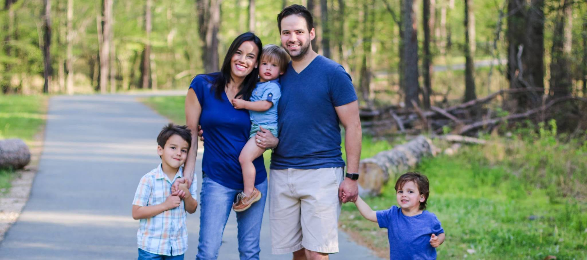

<AnchorLinks>
  <AnchorLink>About Me</AnchorLink>
  <AnchorLink>Education</AnchorLink>
</AnchorLinks>

This md file can be locally linked here... [test md](./test.md)

This pdf should be downloadable from this [link](./test.pdf)

## About Me

My name is Eric Garcia. I am a graduate from Full Sail University with a
Bachelors Degree in <a href="https://www.fullsail.edu/degrees/mobile-development-bachelor" target="_blank">Mobile Development (MDVBS)</a>.

I am currently a **System Architect** at **Verizon**, where I have spent the last two years designing and overseeing the implementation of high-performance, scalable enterprise systems. My career has evolved from deep hands-on software engineering into architectural leadership, focusing on cloud-native strategies, systems integration, and technical excellence across complex infrastructures. I remain passionate about technical mentorship and building resilient digital experiences.

{/* Need to add links to about and portfolio sections */}

If you would like to see some of the projects and applications I have worked
on this can be found in my Portfolio

## Education

### Full Sail

Classes were focused on teaching a few skills each week and require you to build an app
with specific requirements to show comprehension of skills taught. <a href="https://www.fullsail.edu/degrees/mobile-development-bachelor" target="blank"> Degree overview</a>.

{/* MDVBS Video */}

  <iframe
    width="560"
    height="315"
    src="https://www.youtube-nocookie.com/embed/5FohgYaD9OU"
    title="YouTube video player"
    frameborder="0"
    allow="accelerometer; autoplay; clipboard-write; encrypted-media; gyroscope; picture-in-picture"
    allowfullscreen
  ></iframe>

### Development-centered Courses Completed

- Mobile Media Design I & II
- Scalable Data Infrastructures & Advanced Scalable Data Infrastructures
- Visual Frameworks & Advanced Visual Frameworks
- Mobile Interfaces and Usability
- Mobile User Experience
- Apple Programming Language: Objective C I & II
- Mobile Development Frameworks I, II, & III
- Application Deployment iOS
- Java I & II
- Mobile Player Experience
- Application Deployment Android
- Cross-Platform Mobile Development

For detailed description of
courses please refer to: <a href="https://www.fullsail.edu/degrees/mobile-development-bachelor/courses" target="blank">Courses</a>
