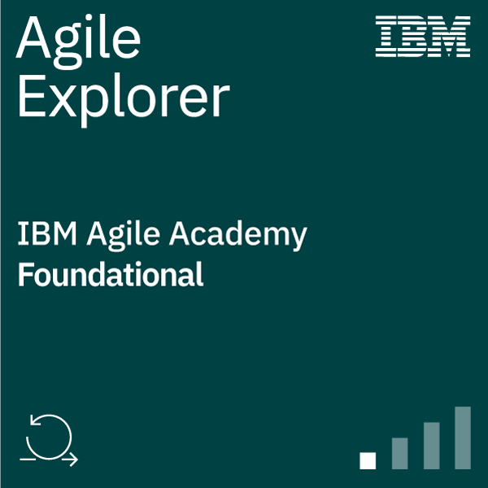
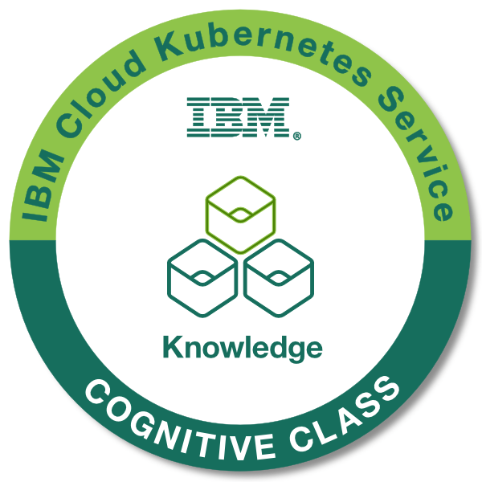

import HomepageTemplate from 'gatsby-theme-carbon/src/templates/Homepage';
export default HomepageTemplate;

import { Link } from 'gatsby';

<!-- TODO: Fill out Homepage -->

## Welcome!!

This site is setup to showcase my professional career and hobbies as a Software Engineer.

You can find out more about me on the <Link to="about">About</Link> page.

## Badges earned

<!--  -->

<Row className="image-card-group">
<Column colMd={2} colLg={2} noGutterSm>
<ImageCard title="Agile explorer" href="https://www.credly.com/badges/84c7f84c-eb57-489a-93ce-f0701008b7e3/public_url" actionIcon="Launch">
          

</ImageCard>
</Column>
<Column colMd={2} colLg={2} noGutterSm>
<ImageCard title="IBM Cloud Kubernetes Service" href="https://www.credly.com/badges/836c8f8f-fdd6-41aa-a310-ca38c0a6e54e/public_url" actionIcon="Launch">
          

</ImageCard>
</Column>
<Column colMd={2} colLg={2} noGutterSm>
<ImageCard title="IBM Carbon Design System Developer Essentials - React" href="https://www.credly.com/badges/de8ea4d0-1d49-4084-bc16-3b0a5366d354/public_url" actionIcon="Launch">
          

</ImageCard>
</Column>
<Column colMd={2} colLg={2} noGutterSm>
<ImageCard title="Enterprise Design Thinking Practitioner" href="https://www.credly.com/badges/36ddd342-c057-4624-9738-504cd982d585/public_url" actionIcon="Launch">
          

</ImageCard>
</Column>
</Row>
